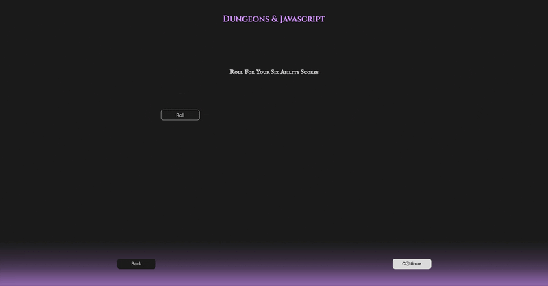

### Dungeons & Javascript

> _An ongoing project which takes the form of a web-based Dungeons & Dragons-inspired text adventure built using vanailla JavaScript and OOP principles. The user decides upon a name, species and class for their character, which generates their character's stats, skills and equipment. They then engage in a text-based series of challenges, with their success depending on their character's stats and virtual dice rolls._ 

  

The game is heavily inspired by the popular table-top role-playing game Dungeons & Dragons. For more information on the basic rules behind D&D, go to: https://dnd.wizards.com/what-is-dnd/basic-rules.

To emulate the dice rolls that are a fundamental part of D&D, I sources and adapted code written by BryanBansbach (https://github.com/BryanBansbach/DiceRoller). The rest of the game is made up of original code and is a work in progress.

Ongoing/Further Developments

- Refactor code for simplicity and to ensure pure classes/functions
- Seperate classes and function code into seperate files
- Redesign and implement updated styles
- Add user instructions at the start of the game
- Add story elements to the text-based content of the game
